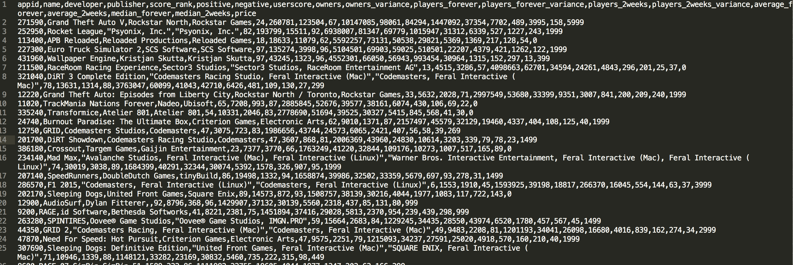
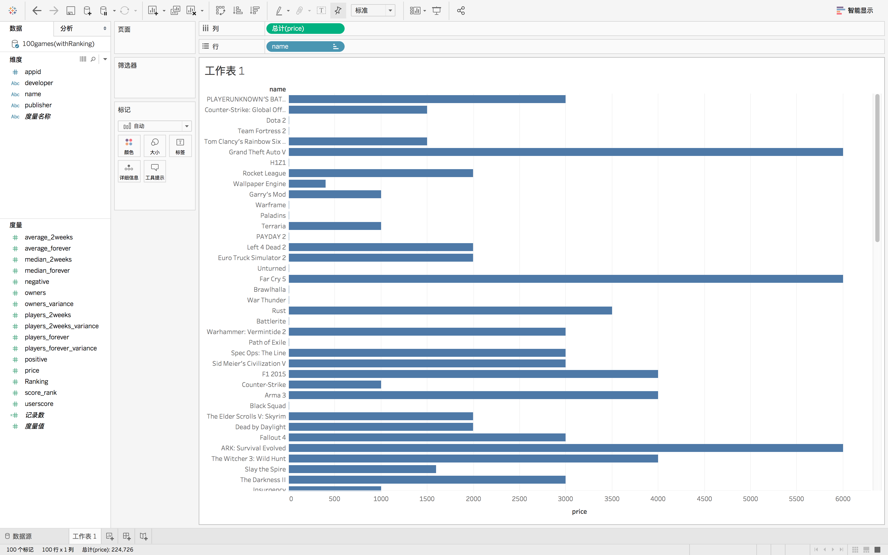
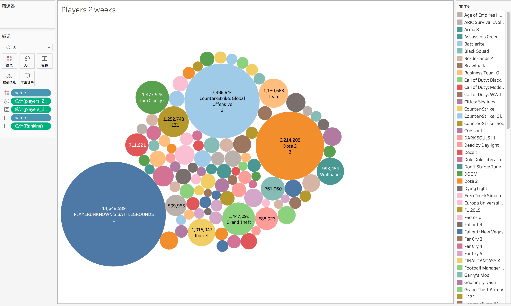
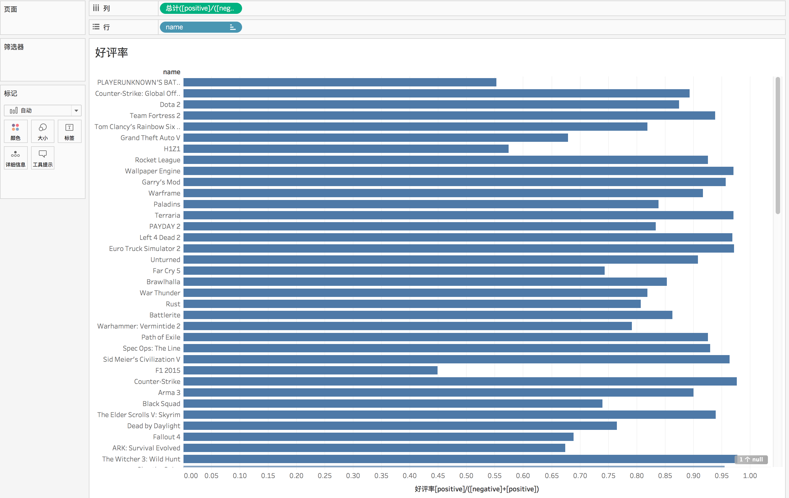
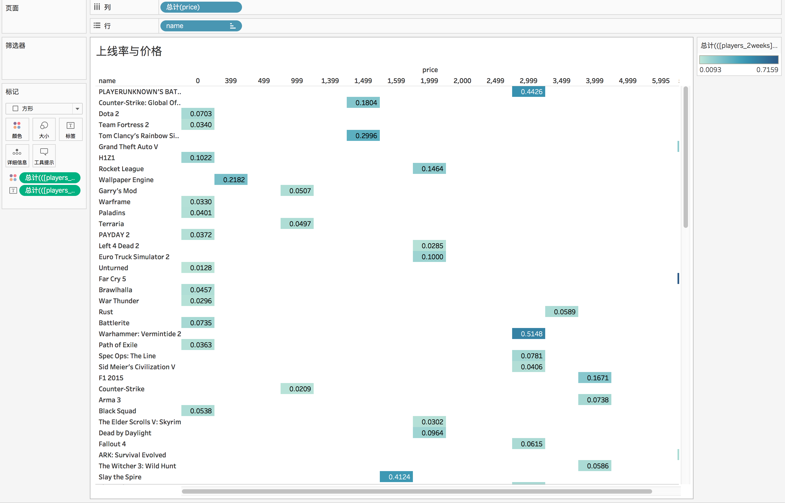

# steam game visualization Project

## Introduction
This project aims to perform some interesting finding form the STEAM database. And the results will be performed as a webpage.

## Tools that will used:
1. Tableau: you can have a student licence by clicking this website:(https://www.tableau.com/zh-cn/academic/students)
2. D3.js

## Files introduction:
1. **convertJSON_to_CSV.py:**
Try to convert the JSON file into CSV in a correct format. (You need to edit the JSON file name if you want to convert other JSON file).

2. **100g.json:**
The original file that gets form steamspy website（https://steamspy.com/api.php）

3. **100games.csv:** 
The converted format csv file.

Here is the converted CSV file:

## Here is some results(in Tableau):

* Showing the price of top 100 games (according to the rank)

* Player 2 weeks: how many players play games:
Shows how many

* Rank and Comment:
  * Y is the game name(ordered by ranking)
  * X is about the comment: (positive comment/ all comments)

* Owners of those games:

* Price Rating Comment:

